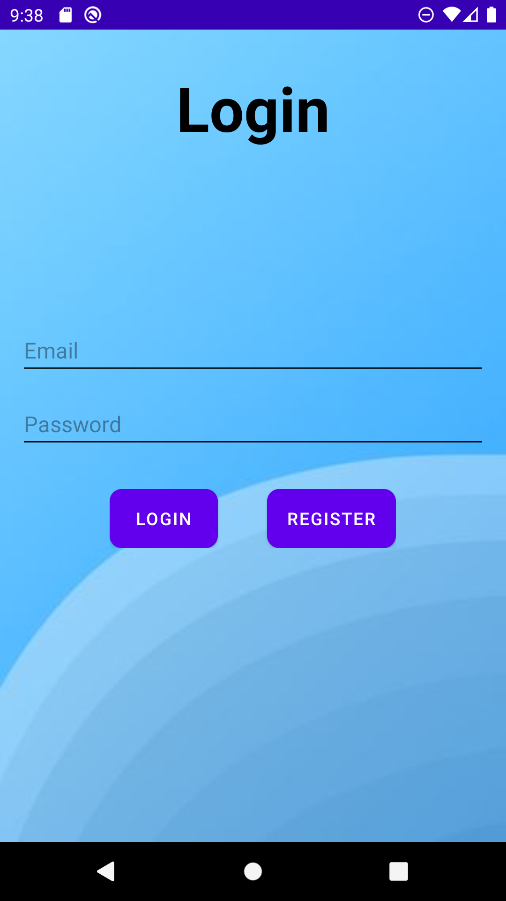

<!-- CONTACT -->
## Contact

Lam Thinh Phat - [Phát Sankar](https://www.facebook.com/phat.sankar/) - lamthinhphat2001@gmail.com

Project Link: [https://github.com/LamThinhPhat/RSSeaderKMS](https://github.com/LamThinhPhat/RSSeaderKMS)

(<a href="#top">back to top</a>)

<!-- ABOUT THE PROJECT -->
## About The Project

The project is not build with any special library so the project doesn't have to change any settings. You just have to use "Android Studio" to build the project

### Built With

This section should list any major frameworks/libraries used to bootstrap your project. Leave any add-ons/plugins for the acknowledgements section. Here are a few examples.

* Kotlin (Language)
* Picasso (Library - Load image from URL)
* SpotDialog (Library - Show progress dialog)
* Android Studio (IDE)
* Firebase Authentication (For Log in and Sign up)
* Firebase Database Realtime (For storing data's infomation)

<!-- GETTING STARTED -->

## Getting Started

Firstly, we will start at Login Screen

## Register Account

If you currently don't have an account, press the "Register" button to transit to register activity

[![Register Account][register]

## Input information

We will input name, email and password which we're gonna use to login

[![Input information][register_input]]

## Log in

After successfully registering, we will use email and password which we've just used to login

[![Log in][login_input]]

## At main page

After logging in, this will be the mainpage.

[![At main page][mainpage]]

## input URL and press "Search" button

Input the URL which you want to access and the press "Search" to get object from URL

[![input URL and press "Search" button][input_url_news]]

## Watch news's content

After the application has done searching news, click one news on the list to access to the content page

[![Watch news's content][detail_news]]

## At the bottom bar

At the bottom bar, there will be two icon. Click "Profile" icon to change to "Profile" fragment

[![At the bottom bar][profile]]

## Edit Info Account

Click "Account" row in "Profile" fragment to change to Edit Info Activity

[![Edit Info Account][edit_name]]

## Change Avatar

Click default profile Image to start choosing your own avatar

[![Change Avatar][pick_avatar]]

## After pick Avatar

Default profile Image will be change to the image you've just picked and click "Edit info" button to save.

[![After pick Avatar][after_pick]]

## After save info

As you can see, the avatar and name have been changed

[![After save info][account_info_change]]

## Mark news for later

At the main page, after searching the URL, you can mark any news for later by clicking the star on the right of each row. If you click the empty star which is not currently in account's favorite list then it'll change to full yellow star and vice versa.

[![Mark news for later][click_star]]

## Favorite news

Click "Favorite" row in "Profile" fragment to change to Favorite news Activity

[![Favorite news][In_Favorite]]

## Unmark a news in Favorite List

In Favorite list, If you click the star, the news will be remove from account's Favorite list

[![Unmark a news in Favorite List][after_unmark]]

[account_info_change]: images/account_info_change.png
[after_unmark]: images/after_unmark.png
[after_pick]: images/after_pick.png
[click_star]: images/click_star.png
[detail_news]: images/detail_news.png
[edit_name]: images/edit_name.png
[In_Favorite]: images/In_Favorite.png
[input_url_news]: images/input_url_news.png
[Login]: images/Login.png
[login_input]: images/login_input.png
[mainpage]: images/mainpage.png
[pick_avatar]: images/pick_avatar.png
[profile]: images/profile.png
[register]: images/register.png
[register_input]: images/register_input.png

